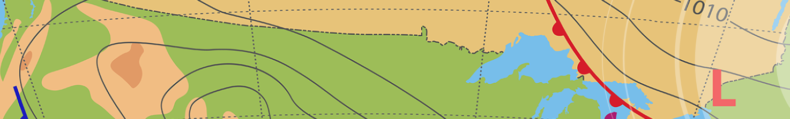
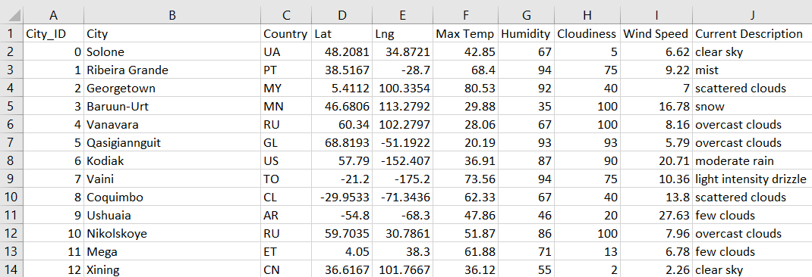
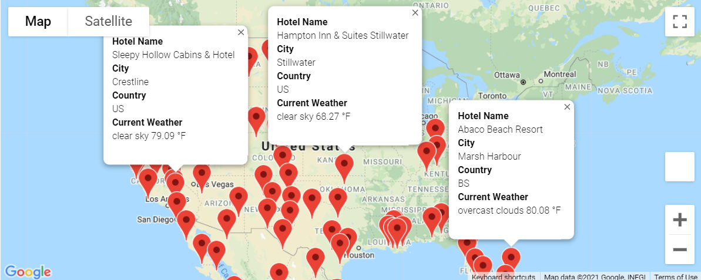
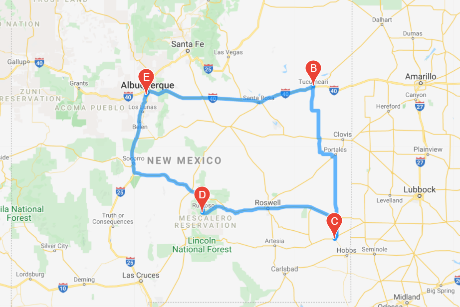
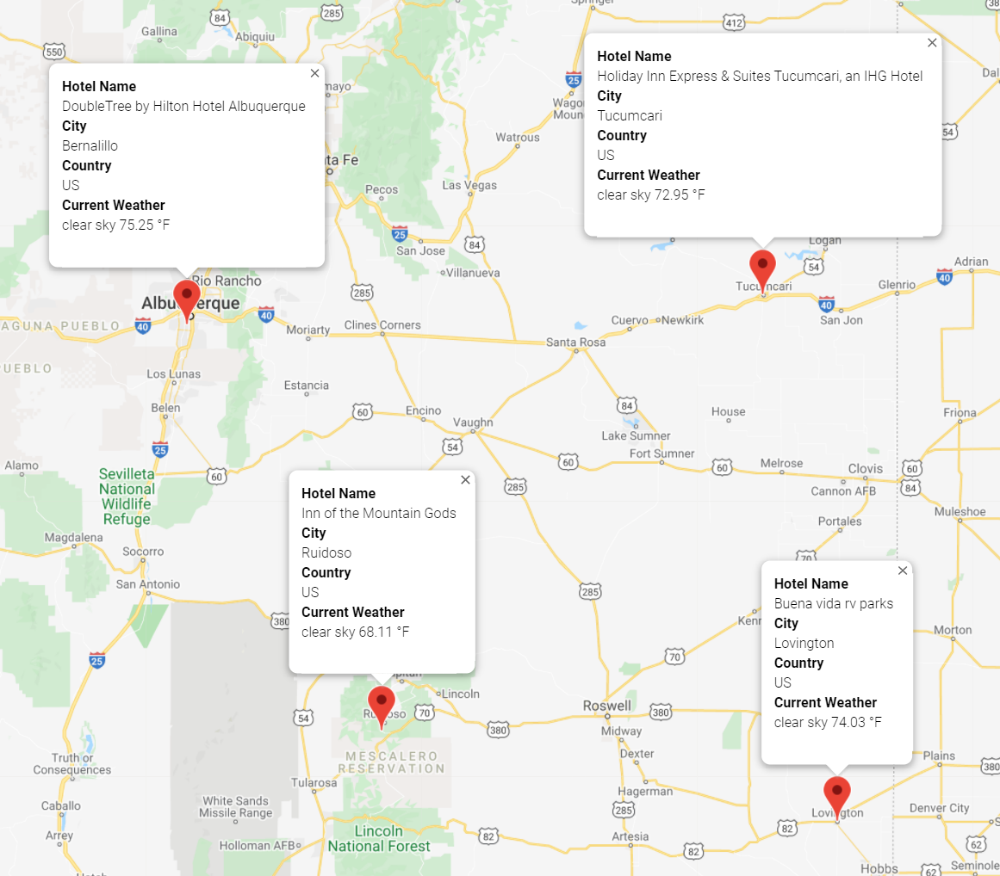

# World Weather Analysis

## Project Overview
#### This analysis project provides a visualization for identifying potential travel destinations. APIs from OpenWeatherMap and Google Maps were utilized in this analysis. The areas of focus for this project include the following:

1) Retrieving Weather Data for over 2,000 locations

2) Create a Customer Travel Destination Map

3) Create a Travel Itinerary Map

